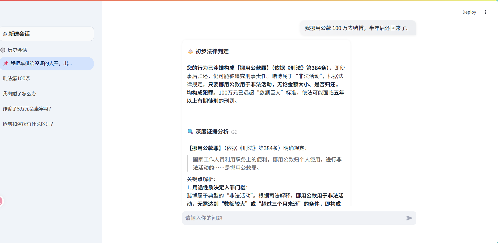

# 法律智能问答助手（RAG + 混合召回 + 记忆压缩）

本项目是一个面向法律问答场景的本地 RAG 系统，基于 Streamlit 提供上传与对话双页面，结合 Chroma 向量检索、BM25 关键词检索与 RRF 融合，并引入会话记忆压缩机制，支持较长多轮对话。

## 1. 项目能力

- 文档入库：法律文本预处理、分块、向量化并持久化到 Chroma。
- 混合召回：向量检索 + BM25 并行召回，通过 RRF 融合后返回证据。
- 生成回答：使用通义千问大模型按法律模板输出结构化回复。
- 会话管理：会话列表、新建、置顶、删除、持久化历史。
- 记忆压缩：滑动窗口 + 摘要压缩 + Token 预算裁剪。
- 可观测性：可开启压缩调试日志，直接在控制台查看压缩过程。

当前模型配置：

- 主回答模型：`qwen3-max`
- 轻量摘要模型：`qwen-turbo`
- 向量模型：`text-embedding-v4`

预览：



## 2. 目录结构

```text
KnowledgeBase-RAG-LLM-System/
├── app/
│   ├── streamlit_chat.py            # 对话页面
│   └── streamlit_upload.py          # 文档上传与入库页面
├── core/
│   └── config.py                    # 全局配置（检索/模型/记忆压缩）
├── generation/
│   └── rag_service.py               # RAG 主链路（检索->提示词->生成）
├── retrieval/
│   └── hybrid_retriever.py          # 向量 + BM25 + RRF
├── ingestion/
│   ├── legal_preprocess.py          # 文本预处理
│   ├── legal_chunker.py             # 分块与元数据
│   └── ingest_service.py            # 入库服务
├── infra/
│   └── vector_store.py              # 向量库封装
├── memory/
│   └── history_store.py             # 会话持久化与压缩策略
├── test/
│   ├── test_memory_compression.py   # 记忆压缩单元测试
│   └── validate_memory_compression.py # 压缩行为演示脚本
├── data/                            # 原始法律文本与知识文件
├── doc/                             # 方案、流程图、总结文档
├── chroma_db/                       # 运行后生成：向量库
├── chat_history/                    # 运行后生成：会话历史
├── requirements.txt
└── README.md
```

## 3. 环境准备

建议 Python 3.10 或 3.11。

### 3.1 使用 uv（推荐）

```powershell
uv venv --python 3.11
.\.venv\Scripts\Activate.ps1
uv pip install -r requirements.txt
```

### 3.2 使用 pip

```powershell
python -m venv .venv
.\.venv\Scripts\Activate.ps1
pip install -r requirements.txt
```

## 4. 环境变量

在项目根目录创建 `.env`：

```env
DASHSCOPE_API_KEY=sk-你的真实密钥
DASHSCOPE_BASE_URL=https://dashscope.aliyuncs.com/compatible-mode/v1
ANONYMIZED_TELEMETRY=False
```

## 5. 启动方式

在项目根目录执行。

### 5.1 启动上传页面（先入库）

```powershell
.\.venv\Scripts\python.exe -m streamlit run app/streamlit_upload.py
```

或：

```powershell
uv run streamlit run app/streamlit_upload.py
```

### 5.2 启动聊天页面

```powershell
.\.venv\Scripts\python.exe -m streamlit run app/streamlit_chat.py
```

或：

```powershell
uv run streamlit run app/streamlit_chat.py
```

如果虚拟环境已激活，可简写：

```powershell
streamlit run app/streamlit_upload.py
streamlit run app/streamlit_chat.py
```

## 6. 关键配置说明

配置文件：`core/config.py`

### 6.1 检索相关

- `hybrid_vector_k`: 向量召回候选数
- `hybrid_bm25_k`: BM25 召回候选数
- `hybrid_final_k`: 融合后最终证据数
- `hybrid_rrf_k`: RRF 融合参数

### 6.2 记忆压缩相关

- `memory_keep_recent_rounds`: 保留最近轮次（当前 3）
- `memory_summary_trigger_rounds`: 摘要触发轮次（当前 5）
- `memory_history_max_tokens`: 历史 token 预算（当前 4000）
- `memory_summary_max_chars`: 摘要最大字符（当前 1500）
- `memory_summary_enabled`: 是否启用摘要
- `memory_summary_tag`: 内部摘要标识
- `memory_compression_debug`: 是否打印压缩日志（当前开启）

## 7. 记忆压缩策略（当前实现）

在 `memory/history_store.py` 中执行：

1. 识别内部摘要消息与普通对话消息。
2. 普通消息按用户发言切分轮次。
3. 优先保留最近 N 轮。
4. 达到触发阈值时，将更早轮次交给 `qwen-turbo` 做增量摘要。
5. 重建为“摘要 + 最近轮次”。
6. 若超 Token 预算，按轮次删除最近窗口中最旧轮，直到满足预算或仅剩 1 轮。

说明：内部摘要对模型可见、对用户界面不可见（聊天页已过滤）。

## 8. 测试与验证

### 8.1 单元测试

```powershell
python -m unittest discover -s test -p "test_memory_compression.py" -v
```

### 8.2 行为演示（打印压缩行为）

```powershell
python test/validate_memory_compression.py
```


## 9. 免责声明

本项目输出仅用于学习与技术验证，不构成正式法律意见。涉及真实法律事务请咨询持证律师。