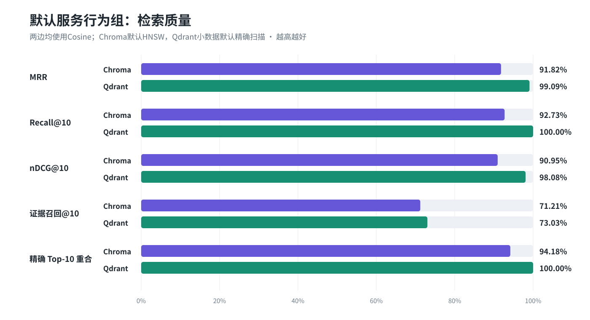
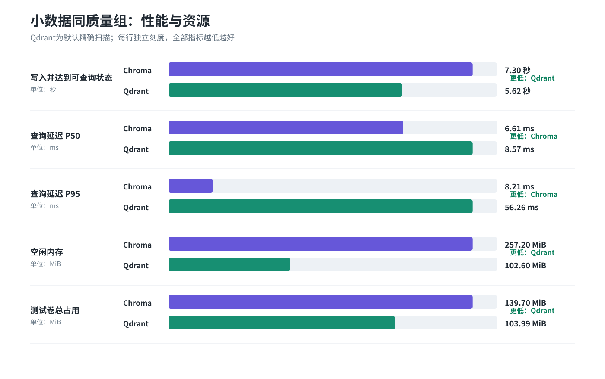
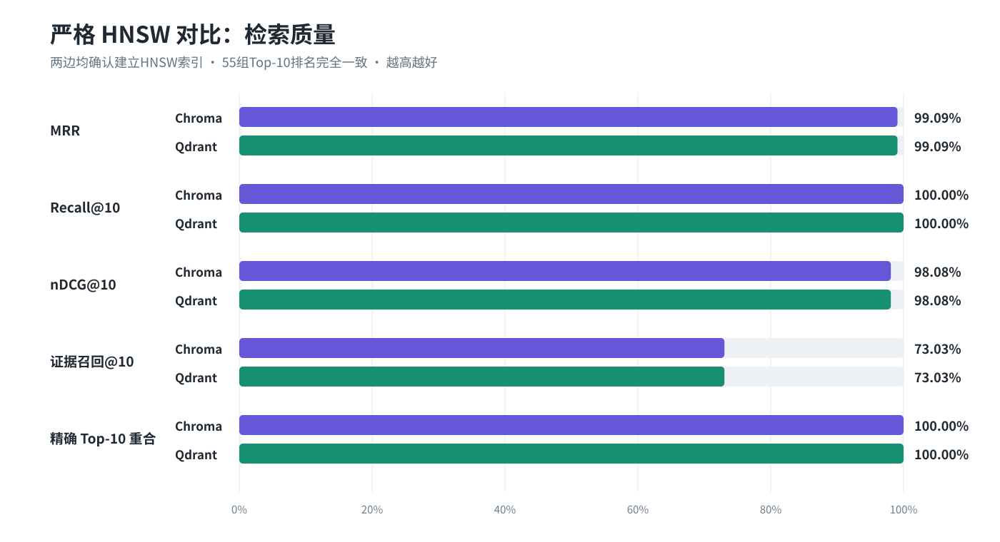
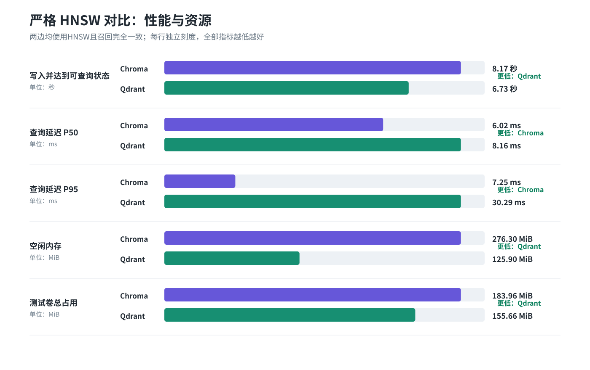

# 05 Chroma 与 Qdrant 独立服务对比

## 1. 本节点解决什么问题

前面的嵌入式预检只能证明两种客户端都能正确保存和查询向量，不能代表真实独立服务的性能。本节点把完全相同的切块、向量和问题分别写入 Chroma 与 Qdrant Docker 服务，回答三个问题：

1. 默认索引配置是否会漏掉本应召回的向量；
2. 在召回质量相同后，写入和查询速度差多少；
3. 当前数据能否支持替换向量数据库的决定。

三组都已完成实际建库和查询，不是根据理论参数推算：

| 对比组 | Chroma | Qdrant | 状态 |
|---|---|---|---|
| 默认服务行为组 | Cosine + 默认 HNSW | 小数据量默认回退为精确扫描 | 已完成 |
| 小数据同质量组 | 调优 HNSW：`ef_construction=200, M=32, ef_search=200` | 默认精确扫描 | 已完成 |
| 严格 HNSW 同质量组 | `M=32, ef_construction=200, ef_search=200` | `M=32, ef_construct=200, hnsw_ef=300` | 已完成，实际索引2,881条 |

## 2. 已覆盖的对比维度

| 类别 | 已测指标 |
|---|---|
| 数据正确性 | 写入条数、重新打开后的条数、自向量 Top-1/Top-K 命中 |
| 建库性能 | 2,881 条向量写入耗时、索引就绪等待时间 |
| RAG 检索质量 | MRR、Hit/Recall@1/3/5/10、nDCG@1/3/5/10 |
| 证据质量 | 证据召回@1/3/5/10、完整证据命中@1/3/5/10 |
| ANN 准确度 | 与暴力精确 Cosine 的 Top-1 一致率、Top-10 重合率 |
| 查询性能 | 预热后 275 次查询的平均、P50、P95 延迟 |
| 跨库一致性 | 两库 Top-10 平均重合率、完全相同的排名数量 |
| 资源快照 | 空闲 CPU、空闲内存、测试卷总体占用 |
| 服务形态 | Docker 独立服务、固定版本、健康检查和持久化卷 |

尚未覆盖的是并发 QPS、大规模数据（10 万/100 万以上）、复杂元数据过滤、批量更新/删除、备份恢复、高可用集群和混合稀疏检索。这些不能从本轮小数据测试中推断。

## 3. 测试条件

| 项目 | 值 |
|---|---:|
| 中文评测问题 | 55 |
| 结构感知切块 | 2881 |
| 嵌入模型 | `text-embedding-v4` |
| 向量维度 | 2048 |
| 距离函数 | Cosine |
| Chroma 服务 | `chromadb/chroma:1.5.9`，`127.0.0.1:18000` |
| Qdrant 服务 | `qdrant/qdrant:v1.19.1`，`127.0.0.1:16333` |
| 查询计时 | 2 轮预热 + 5 轮实测，共 275 次/数据库 |

所有向量都来自同一份本地缓存，没有再次调用嵌入 API。两个数据库的写入顺序、查询顺序、Top-K 和评价方法相同。

## 4. 第一轮：默认服务行为

两边都使用 Cosine 距离，其余配置使用数据库默认值。检查集合状态后发现，Qdrant 的 `indexed_vectors_count=0`：2,881条向量被拆在多个小段中，每段都没有达到默认10,000 KB索引阈值，因此Qdrant实际使用精确扫描，而不是HNSW。



| 指标 | Chroma | Qdrant |
|---|---:|---:|
| 写入 2,881 条 | 7.215 秒 | 5.035 秒 |
| MRR | 0.918182 | 0.990909 |
| Recall@10 | 92.73% | 100.00% |
| nDCG@10 | 0.909542 | 0.980810 |
| 证据召回@10 | 71.21% | 73.03% |
| 与精确 Top-1 一致 | 92.73% | 100.00% |
| 与精确 Top-10 平均重合 | 94.18% | 100.00% |
| 查询 P50 | 6.06 ms | 7.70 ms |
| 查询 P95 | 7.28 ms | 31.23 ms |

默认服务行为下，Chroma更快，但它有3个问题的Top-1与精确Cosine结果不同，Top-10平均重合率为94.18%。Qdrant因为走精确扫描而与精确结果完全一致，所以本轮延迟不能解释成“HNSW性能差异”。

## 5. 第二轮：小数据同质量服务行为

只提高已建索引的 `ef_search`（100、150、200、300、400、800）没有改变 Chroma 的漏召回，说明问题来自构建阶段。随后测试三组重建参数：

| Chroma 参数 | 精确 Top-1 一致 | 精确 Top-10 重合 | 探测 P50 |
|---|---:|---:|---:|
| `ef_construction=200, M=32, ef_search=200` | 100% | 100% | 5.30 ms |
| `ef_construction=400, M=48, ef_search=400` | 100% | 100% | 6.21 ms |
| `ef_construction=800, M=64, ef_search=800` | 100% | 100% | 6.73 ms |

正式第二轮采用第一组最小充分参数。Qdrant默认精确扫描已经达到100%，所以这一轮保留默认，用来比较“当前小型知识库按产品默认方式运行”的实际表现。


| 指标 | Chroma（调优） | Qdrant（默认） |
|---|---:|---:|
| 写入 2,881 条 | 7.305 秒 | 5.615 秒 |
| MRR | 0.990909 | 0.990909 |
| Recall@10 | 100.00% | 100.00% |
| nDCG@10 | 0.980810 | 0.980810 |
| 证据召回@10 | 73.03% | 73.03% |
| 精确 Top-1 一致 | 100.00% | 100.00% |
| 精确 Top-10 重合 | 100.00% | 100.00% |
| 查询 P50 | 6.61 ms | 8.57 ms |
| 查询 P95 | 8.21 ms | 56.26 ms |

第二轮两边的55组Top-10排名完全相同。Chroma的P50约为Qdrant的 **1/1.30**，但这仍然是“Chroma HNSW 对 Qdrant 精确扫描”，不能作为HNSW引擎之间的最终比较。



## 6. 第三轮：严格 HNSW 对 HNSW

为了排除Qdrant精确扫描回退，第三轮执行了以下约束：

- Qdrant上传阶段临时提高索引阈值，写完后一次性将阈值降到1,000 KB，避免边写边反复建图；
- Qdrant的 `full_scan_threshold=10`（服务端允许的最小值），查询设置 `exact=False, indexed_only=True`；
- 正式计时前验证Qdrant状态为 `green`，且 `indexed_vectors_count=2881`；
- 两边使用相同的 `M=32` 与构建宽度200；Qdrant需要 `hnsw_ef=300`、Chroma使用 `ef_search=200` 才都达到100%精确Top-10重合。



| 指标 | Chroma HNSW | Qdrant HNSW |
|---|---:|---:|
| 完成写入与索引 | 8.170 秒 | 6.731 秒 |
| Qdrant上传/建图 | — | 6.172 / 0.559 秒 |
| 实际索引向量 | 2,881 | 2,881 |
| MRR | 0.990909 | 0.990909 |
| Recall@10 | 100.00% | 100.00% |
| 精确Top-1一致 | 100.00% | 100.00% |
| 精确Top-10重合 | 100.00% | 100.00% |
| 查询P50 | 6.02 ms | 8.16 ms |
| 查询P95 | 7.25 ms | 30.29 ms |



严格HNSW同质量条件下，Qdrant建库总耗时更低；Chroma的P50查询延迟约为Qdrant的 **1/1.36**。Qdrant本轮P95为30.29 ms，明显高于P50，说明当前Windows Docker环境存在尾延迟波动，后续并发测试必须继续观察。

## 7. 资源快照

| 指标 | Chroma | Qdrant |
|---|---:|---:|
| 空闲内存 | 257.2 MiB | 102.6 MiB |
| 空闲 CPU | 0.00% | 0.36% |
| 测试卷占用 | 139.7 MiB | 104.0 MiB |

Chroma 的本次空闲内存约为 Qdrant 的 **2.51 倍**。卷中同时保留默认和调优集合，因此这里只用于观察总体量级，不能视作单集合精确空间成本。

第三轮完成后的容器快照为Chroma 276.3 MiB、Qdrant 125.9 MiB；数据卷已累积三个集合，因此同样不能作为单个HNSW集合的净占用。

## 8. 当前结论

对于当前 2,881 个切块的中文小型知识库：

- Qdrant在当前小数据量下默认不会建立HNSW，而会使用精确扫描；这解释了前两轮的100%质量和较高查询延迟。
- 强制双方都使用HNSW后，两边的55组Top-10结果仍完全一致，证明第三轮满足同质量条件。
- 严格HNSW组中，Qdrant建库更快、空闲内存更低；Chroma的P50和P95更低，但Qdrant高尾延迟需要在并发测试中复核。
- 本轮结果不支持简单地说“Qdrant 一定比 Chroma 快”或“必须替换 Chroma”。两者的优势维度不同。
- 如果目标是当前单机、小数据量、低并发应用，升级后的 Chroma 仍然是合理选择；如果目标包含更大规模、并发、分布式、复杂过滤和长期运维，仍需要下一阶段压力与功能测试后再决定是否切换 Qdrant。

因此，**当前不立即替换数据库**。保留统一向量存储接口，让 Chroma 和 Qdrant 都可插拔；后续前端也不直接依赖任何一个数据库的私有 API。

## 9. 如何复现

确保两个 Docker 服务已启动：

```powershell
docker start rag-chroma-benchmark rag-qdrant-benchmark
```

运行默认轮：

```powershell
.\.venv\Scripts\python.exe scripts\run_vector_server_benchmark.py --profile default
```

运行同等质量轮：

```powershell
.\.venv\Scripts\python.exe scripts\run_vector_server_benchmark.py --profile tuned
```

运行严格HNSW同质量轮：

```powershell
.\.venv\Scripts\python.exe scripts\run_vector_server_benchmark.py --profile hnsw_matched
```

重新生成本文和图表：

```powershell
.\.venv\Scripts\python.exe scripts\generate_node5_vector_report.py
```

## 10. 原始结果位置

- `storage/evaluations/zh_public_minibench_v0.1/reports/node5_server_default_benchmark.json`
- `storage/evaluations/zh_public_minibench_v0.1/reports/node5_server_tuned_benchmark.json`
- `storage/evaluations/zh_public_minibench_v0.1/reports/node5_server_hnsw_matched_benchmark.json`
- `storage/evaluations/zh_public_minibench_v0.1/reports/node5_server_resource_snapshot.json`
- `storage/evaluations/zh_public_minibench_v0.1/reports/node5_server_hnsw_resource_snapshot.json`
- `storage/evaluations/zh_public_minibench_v0.1/reports/node5_embedded_vector_preflight.json`
- `storage/evaluations/zh_public_minibench_v0.1/reports/node5_embedded_real_query_baseline.json`

## 11. 工程落地方式

评测完成后，项目已经把“选择数据库”从业务代码中拆开：

```text
上传/切块/检索/RAG
        ↓
VectorStoreService（统一入口）
        ↓
ChromaAdapter 或 QdrantAdapter
```

当前规则如下：

- 默认 `VECTOR_STORE=chroma`，不会同时写入 Qdrant；
- `CHROMA_MODE=local` 延续本地持久化方式，也可以改成 `http` 连接独立服务；
- 需要复测 Qdrant 时只改 `VECTOR_STORE=qdrant`，上传、检索和混合召回代码无需修改；
- 两个后端统一提供写入、相似度检索、全量读取、数量统计和健康检查；
- 每条向量元数据统一写入模型名、维度和 `VECTOR_SCHEMA_VERSION`，健康检查返回同一组版本信息；
- `text-embedding-v4` 请求显式发送 `dimensions=2048`，避免 SDK 默认维度悄悄变化；
- Chroma 和 Qdrant 在打开已有集合时都会检查向量维度，不一致就立即报错。

### 11.1 为什么使用新的集合名

检查原项目本地库后确认，旧 `rag` 集合有128条向量，维度是1024。当前方案已经确定为 `text-embedding-v4 / 2048维`，1024维和2048维不能放进同一集合，也不能互相查询。

因此默认集合改为：

```text
rag_text_embedding_v4_2048
```

旧 `rag` 集合经确认后已删除，其中原有128条1024维向量不再参与后续开发。2026-09-30 已把53份文档的2,881条结构感知切块及缓存向量导入应用默认使用的 `rag_text_embedding_v4_2048` 集合，维度为2048。集合名携带模型和维度，后续更换模型时应继续新建版本，避免不同维度混用。

入库脚本为 `scripts/import_cached_chroma.py`：先核对切块文本哈希、缓存模型、维度、向量有效性及来源文档，再按稳定切块ID执行upsert。保留文件名、原文件路径、元素ID、页码/表格位置等来源信息；嵌套字段以JSON字符串存入元数据。重复执行不会新增重复切块，目标包含其他数据时拒绝导入。

验收已完成：全量核对2,881条文本、来源元数据及向量；经应用服务接口验证全量读取、相似检索和来源过滤。整个导入过程没有调用嵌入API。只导入文档切块，55条问题向量继续留在评测缓存中。

复现命令：`.venv/Scripts/python.exe scripts/import_cached_chroma.py`。依赖本地已有解析、切块和嵌入缓存。运行数据库保存在 `chroma_db/`，已从Git跟踪中移除并加入忽略规则；Git提交代码、文档和导入脚本，不包含运行数据库或密钥。

### 11.2 切换配置

默认本地 Chroma：

```dotenv
VECTOR_STORE=chroma
VECTOR_COLLECTION=rag_text_embedding_v4_2048
CHROMA_MODE=local
CHROMA_PERSIST_DIRECTORY=chroma_db
```

Chroma 独立服务：

```dotenv
VECTOR_STORE=chroma
CHROMA_MODE=http
CHROMA_HOST=127.0.0.1
CHROMA_PORT=18000
```

Qdrant 独立服务：

```dotenv
VECTOR_STORE=qdrant
QDRANT_URL=http://127.0.0.1:16333
```

### 11.3 核心代码位置

- `infra/vector_store.py`：业务统一入口；
- `infra/vector_stores/base.py`：统一接口和健康状态；
- `infra/vector_stores/chroma.py`：Chroma 本地/HTTP 适配；
- `infra/vector_stores/qdrant.py`：Qdrant 适配；
- `infra/vector_stores/factory.py`：按环境变量选择后端；
- `retrieval/compatible_embeddings.py`：固定模型和维度的嵌入客户端。

节点5收口时共执行52项自动化测试，覆盖原有解析、切块、记忆等回归，以及嵌入请求参数、两个适配器读写、后端选择和维度冲突保护。

## 12. 参考依据

- [Qdrant：调优前必须检查集合是否真正建立索引](https://qdrant.tech/documentation/search-tuning/before-tuning-a-qdrant-collection/)
- [Qdrant：小集合可能出现 `indexed_vectors_count=0`](https://qdrant.tech/documentation/manage-data/collections/)
- [Qdrant：`indexing_threshold` 与 `full_scan_threshold` 配置](https://qdrant.tech/documentation/operations/configuration/)
